---
hide:
  - toc
---

# Examples

Examples are provided in the form of code (either Java or Blockly) that must be added to an OpMode. Click an example's dropdown to see its contents.

## OpModes

Each example will use the following OpModes. For the sake of brevity, these are not repeated for each example. If an example mentions 'Control', then it must use the TeleOp OpMode. If it mentions 'Command', then it is primarily intended for use in Autonomous, but command() can be used in TeleOp as well. If neither term is used, then the OpMode type doesn't matter (and if no 'Methods' section is included, then either command() or control() can be used).

=== "Java"

    

    
TeleOp

        package org.firstinspires.ftc.teamcode;

        import com.qualcomm.robotcore.eventloop.opmode.LinearOpMode;
        import com.qualcomm.robotcore.eventloop.opmode.TeleOp;
        // Imports

        @TeleOp(name="Tele", group="dev")
        public class Tele extends LinearOpMode {
            // Additional

            @Override
            public void runOpMode() {
                // Construction

                waitForStart();
                while (opModeIsActive()) {
                    // Methods
                }
            }
        }

    

    

    
Autonomous

        package org.firstinspires.ftc.teamcode;

        import com.qualcomm.robotcore.eventloop.opmode.LinearOpMode;
        import com.qualcomm.robotcore.eventloop.opmode.Autonomous;
        // Imports

        @Autonomous(name="Auto", group="dev")
        public class Auto extends LinearOpMode {
            // Additional

            @Override
            public void runOpMode() {
                // Construction

                waitForStart();
                if (opModeIsActive()) {
                    // Methods
                }
            }
        }

    

    _Note the locations of Imports, Additional, Construction, and Methods_

    ## Example Structure

    - **Imports:** classes and enums that must be imported
    - **Additional:** additional variables and objects that must be setup
    - **Construction:** easy-ftc object construction
    - **Methods:** easy-ftc methods called on constructed objects
    - **Notes:** any relevant details about using the example

    ## Examples

    ### Basic Use

    

    
Control of Motor Mechanism

    ### Imports

        import org.edu_nation.easy_ftc.mechanism.Drive;

    ### Construction

        Drive drive = new Drive.Builder(this, hardwareMap)
            .gamepad(gamepad1)
            .build();

    ### Methods

        drive.control();

    ### Notes

    - The power level of the mechanism can be scaled down (the default is full power)

            drive.control(0.3);

    

    

    
Command of Motor Mechanism

    ### Imports

        import org.edu_nation.easy_ftc.mechanism.Arm;

    ### Construction

        Arm arm = new Arm.Builder(this, hardwareMap)
            .build();

    ### Methods

        arm.command(Arm.Direction.UP, 2, 0.5);

    

    

    
Modify Motor Mechanism Attributes

    ### Imports

        import org.edu_nation.easy_ftc.mechanism.Lift;
        import com.qualcomm.robotcore.hardware.DcMotor;

    ### Construction

        Lift lift = new Lift.Builder(this, hardwareMap)
            .count(2)                                    // use two motors for this mechanism
            .names(new String[]{"liftLeft", "newName"})  // change the names of the motors
            .reverse()                                   // reverse all motors in the mechanism
            .reverse("liftLeft")                         // reverse specific motor
            .reverse(new String[]{"liftLeft", "newName}) // reverse multiple specific motors
            .behavior(DcMotor.ZeroPowerBehavior.FLOAT)   // change the zero-power behavior of the motors
            .build();

    

    

    
Control of Servo Mechanism

    ### Imports

        import org.edu_nation.easy_ftc.mechanism.Claw;

    ### Construction

        Claw claw = new Claw.Builder(this, hardwareMap)
            .gamepad(gamepad1)
            .build();

    ### Methods

        claw.control();

    

    

    
Command of Servo Mechanism

    ### Imports

        import org.edu_nation.easy_ftc.mechanism.Claw;

    ### Construction

        Claw claw = new Claw.Builder(this, hardwareMap)
            .build();

    ### Methods

        claw.command(Claw.Direction.CLOSE);

    

    

    
Modify Servo Mechanism Attributes

    ### Imports

        import org.edu_nation.easy_ftc.mechanism.Claw;

    ### Construction

        Claw claw = new Claw.Builder(this, hardwareMap)
            .count(2)                                    // use two servos for this mechanism
            .names(new String[]{"clawLeft", "newName"})  // change the names of the servos
            .reverse()                                   // reverse all servos in the mechanism
            .reverse("clawLeft")                         // reverse specific servo
            .reverse(new String[]{"clawLeft", "newName}) // reverse multiple specific servos
            .open(0.8).close(0.2)                        // adjust open and close positions
            .delay(3)                                    // adjust the delay for non-smooth movement
            .build();

    

    

    
Read and Display Sensor State

    ### Imports

        import org.edu_nation.easy_ftc.sensor.Touch;

    ### Construction

        Touch touch = new Touch.Builder(hardwareMap)
            .build();

    ### Methods

        telemetry.addData("Touch: ", touch.state());
        telemetry.update();

    

    

    
Modify Sensor Attributes

    ### Imports

        import org.edu_nation.easy_ftc.sensor.Distance;

    ### Construction

        Distance distance = new Distance.Builder(hardwareMap)
            .name("distanceSensor") // change the name of the sensor
            .reverse()              // reverse the sensor state
            .threshold(6.0)         // change the distance threshold
            .build();

    

    ### Enable Features

    

    
Encoder: Velocity-Based Control

    ### Imports

        import org.edu_nation.easy_ftc.mechanism.Drive;

    ### Construction

        Drive drive = new Drive.Builder(this, hardwareMap)
            .encoder()
            .gamepad(gamepad1)
            .build();

    ### Methods

        drive.control();

    ### Notes

    - Unlike command(), adding .diameter() doesn't affect control(), so velocity will be used either way so long as .encoder() is enabled

    

    

    
Encoder: Time-Based Command

    ### Imports

        import org.edu_nation.easy_ftc.mechanism.Drive;

    ### Construction

        Drive drive = new Drive.Builder(this, hardwareMap)
            .encoder()
            .build();

    ### Methods

        // moves forward for 2 seconds at half velocity
        drive.command(Drive.Direction.FORWARD, 2, 0.5);

    

    

    
Encoder: Distance-Based Command

    ### Imports

        import org.edu_nation.easy_ftc.mechanism.Drive;

    ### Construction

        Drive drive = new Drive.Builder(this, hardwareMap)
            .encoder().diameter(4).gearing(19.2)
            .build();

    ### Methods

        // moves forward for 12 inches at half power
        drive.command(Drive.Direction.FORWARD, 12, 0.5);

    ### Notes

    - The distance unit used in command() will be the same as what's used in .diameter()
    - .gearing() is optional here, but correcting it can improve accuracy

    

    

    
Encoder: Limits Using Ticks

    ### Imports

        import org.edu_nation.easy_ftc.mechanism.Lift;

    ### Construction

        Lift lift = new Lift.Builder(this, hardwareMap)
            .encoder().up(300).down(-300)
            .gamepad(gamepad1)  // only needed for teleop
            .build();

    

    

    
Encoder: Limits Using Distance

    ### Imports

        import org.edu_nation.easy_ftc.mechanism.Lift;

    ### Construction

        Lift lift = new Lift.Builder(this, hardwareMap)
            .encoder().diameter(2).gearing(60).up(3).down(-3)
            .gamepad(gamepad1)  // only needed for teleop
            .build();

    ### Notes

    - .gearing() is optional here, but correcting it can improve accuracy

    

    

    
Smooth Servo

    ### Imports

        import org.edu_nation.easy_ftc.mechanism.Claw;

    ### Construction

        Claw claw = new Claw.Builder(this, hardwareMap)
            .smooth()
            .gamepad(gamepad1)  // only needed for teleop
            .build();

    ### Notes

    - The increment and incrementDelay can be adjusted if you'd like to change the 'smoothness' and/or speed

            Claw claw ...
                .smooth().increment(0.04).incrementDelay(0.01)
                ...

    

    

    
Arcade Drive Control

    ### Imports

        import org.edu_nation.easy_ftc.mechanism.Drive;
        import org.edu_nation.easy_ftc.mechanism.Drive.Layout;

    ### Construction

        Drive drive = new Drive.Builder(this, hardwareMap)
            .layout(Layout.ARCADE)
            .gamepad(gamepad1)
            .build();

    ### Methods

        drive.control();

    

    

    
Mecanum Drive

    ### Imports

        import org.edu_nation.easy_ftc.mechanism.Drive;

    ### Construction

        Drive drive = new Drive.Builder(this, hardwareMap)
            .type(Drive.Type.MECANUM)
            .gamepad(gamepad1)  // only needed for teleop
            .build();

    

    

    
Field-Centric Mecanum Drive

    ### Imports

        import org.edu_nation.easy_ftc.mechanism.Drive;
        import org.edu_nation.easy_ftc.mechanism.Drive.Layout;

    ### Construction

        Drive drive = new Drive.Builder(this, hardwareMap)
            .type(Drive.Type.MECANUM).layout(Layout.FIELD)
            .gamepad(gamepad1)  // only needed for teleop
            .build();

    ### Notes

    - LogoFacingDirection and UsbFacingDirection can be changed if field-centric movement is offset

            Drive drive ...
                .logo(LogoFacingDirection.DOWN).usb(UsbFacingDirection.BACKWARD)
                ...

    

    

    
Control of Motor Mechanism with Gamepad Deadzone

    ### Imports

        import org.edu_nation.easy_ftc.mechanism.Lift;

    ### Construction

        Lift lift = new Lift.Builder(this, hardwareMap)
            .gamepad(gamepad1).deadzone(0.1)
            .build();

    ### Methods

        lift.control();

    ### Notes

    - Deadzone only affects mechanisms using either Joysticks or Triggers (Drive and Lift)

    

    ### Advanced Use

    

    
Control with Command Sequence

    ### Imports

        import org.edu_nation.easy_ftc.mechanism.Drive;

    ### Additional

        public enum State {
            ROTATE_LEFT, ROTATE_RIGHT
        }

    ### Construction

        Drive drive = new Drive.Builder(this, hardwareMap)
            .gamepad(gamepad1)
            .build();

        // define the starting state
        State state = State.ROTATE_LEFT;

    ### Methods

        // state machine
        switch (state) {
            case ROTATE_LEFT:
                // initiate sequence when dpad_right is pressed
                if (gamepad1.dpad_right) {
                    drive.command(Drive.Direction.ROTATE_LEFT, 2, 0.5);
                    state = State.ROTATE_RIGHT;
                }
                break;
            case ROTATE_RIGHT:
                drive.command(Drive.Direction.ROTATE_RIGHT, 2, 0.5);
                // restart the sequence once final state is completed
                state = State.ROTATE_LEFT;
                break;
            default:
                state = State.ROTATE_LEFT;
        }

        // terminate sequence when dpad_left is pressed
        if (gamepad1.dpad_left) {
            state = State.ROTATE_LEFT;
        }

        // normal drivetrain control
        drive.control();

    ### Notes

    - Sequence is initiated by pressing dpad_right and can be interrupted with dpad_left
    - Holding down dpad_left works best since the loop used by command() is thread blocking, meaning its value is only read between sequence states

    

=== "Blockly"

    

    
TeleOp

     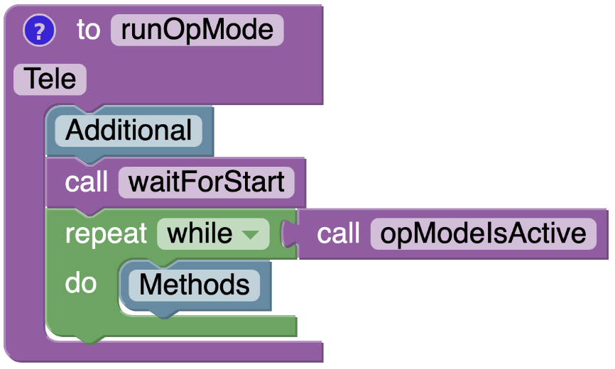{ width=435 }
    

    

    
Autonomous

     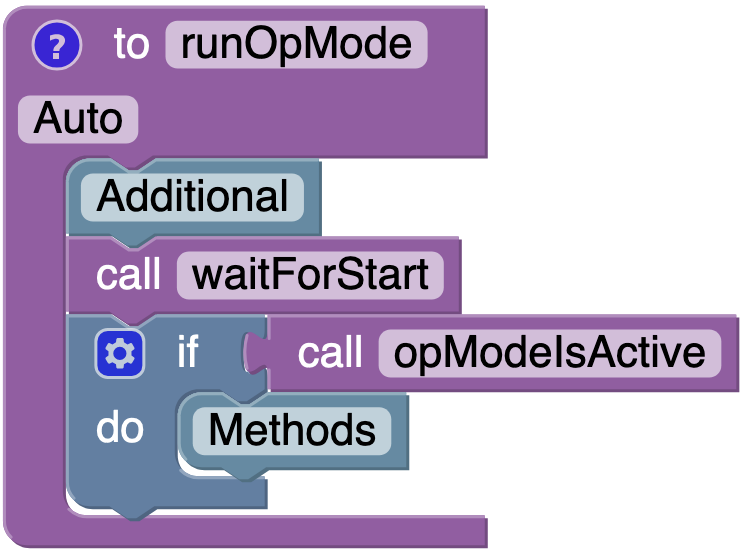{ width=350 }
    

    _Note the locations of Additional and Methods_

    ## MyBlocks

    As Blockly doesn't yet allow the import of non-static, external Java classes, any changes to Imports and Construction must be done in a subsystem's associated MyBlock file rather than the Blockly OpModes above. An abridged form of Arm's MyBlock file is included below, but the exact MyBlock file used will be the one associated with the given subsystem (so if an example is using the Drive subsystem, any changes to Imports or Construction will be made in Drive.java).

    

    
TeleOp

        package org.firstinspires.ftc.teamcode;

        import org.firstinspires.ftc.robotcore.external.BlocksOpModeCompanion;
        import org.firstinspires.ftc.robotcore.external.ExportToBlocks;
        import org.edu_nation.easy_ftc.mechanism.Arm.Direction;
        // Imports

        public class Arm extends BlocksOpModeCompanion {
            @ExportToBlocks(comment = "Initiate an automated arm movement",
                    parameterLabels = {"Direction", "Time", "Power"})
            public static void command(Direction direction, double time, double power) {
                org.edu_nation.easy_ftc.mechanism.Arm arm =
                        new org.edu_nation.easy_ftc.mechanism.Arm.Builder(linearOpMode, hardwareMap)
                                .build();
                arm.command(direction, time, power);
            }

            @ExportToBlocks(
                    comment = "Enable teleoperated arm movement with gamepad (lb, rb) at the specified power",
                    parameterLabels = {"Power"})
            public static void control(double power) {
                // Construction
                arm.control(power);
            }

            @ExportToBlocks(
                    comment = "Enable teleoperated arm movement with gamepad (lb, rb) at a power of 0.5")
            public static void control() {
                // Construction
                arm.control();
            }

            // Direction methods ...
        }

    

    

    
Autonomous

        package org.firstinspires.ftc.teamcode;

        import org.firstinspires.ftc.robotcore.external.BlocksOpModeCompanion;
        import org.firstinspires.ftc.robotcore.external.ExportToBlocks;
        import org.edu_nation.easy_ftc.mechanism.Arm.Direction;
        // Imports

        public class Arm extends BlocksOpModeCompanion {
            @ExportToBlocks(comment = "Initiate an automated arm movement",
                    parameterLabels = {"Direction", "Time", "Power"})
            public static void command(Direction direction, double time, double power) {
                // Construction
                arm.command(direction, time, power);
            }

            @ExportToBlocks(
                    comment = "Enable teleoperated arm movement with gamepad (lb, rb) at the specified power",
                    parameterLabels = {"Power"})
            public static void control(double power) {
                org.edu_nation.easy_ftc.mechanism.Arm arm =
                        new org.edu_nation.easy_ftc.mechanism.Arm.Builder(linearOpMode, hardwareMap)
                                .gamepad(gamepad1).build();
                arm.control(power);
            }

            @ExportToBlocks(
                    comment = "Enable teleoperated arm movement with gamepad (lb, rb) at a power of 0.5")
            public static void control() {
                org.edu_nation.easy_ftc.mechanism.Arm arm =
                        new org.edu_nation.easy_ftc.mechanism.Arm.Builder(linearOpMode, hardwareMap)
                                .gamepad(gamepad1).build();
                arm.control();
            }

            // Direction methods ...
        }

    

    _Note the locations of Imports and Construction_

    ## Example Structure

    - **Imports:** classes and enums that must be imported
    - **Additional:** additional variables and objects that must be setup
    - **Construction:** easy-ftc object construction
    - **Methods:** easy-ftc methods called on constructed objects
    - **Notes:** any relevant details about using the example

    ## Examples

    ### Basic Use

    

    
Control of Motor Mechanism

    ### Methods

     { width=225 }

    ### Notes

    - The power level of the mechanism can be scaled down (the default is full power)

       { width=285 }

    

    

    
Command of Motor Mechanism

    ### Methods

     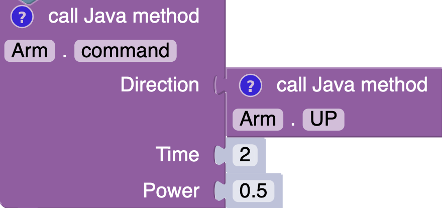{ width=450 }

    

    

    
Modify Motor Mechanism Attributes

    ### Imports

        import com.qualcomm.robotcore.hardware.DcMotor;

    ### Construction

        org.edu_nation.easy_ftc.mechanism.Lift lift =
                new org.edu_nation.easy_ftc.mechanism.Lift.Builder(linearOpMode, hardwareMap)
                        .count(2)                                    // use two motors for this mechanism
                        .names(new String[]{"liftLeft", "newName"})  // change the names of the motors
                        .reverse()                                   // reverse all motors in the mechanism
                        .reverse("liftLeft")                         // reverse specific motor
                        .reverse(new String[]{"liftLeft", "newName}) // reverse multiple specific motors
                        .behavior(DcMotor.ZeroPowerBehavior.FLOAT)   // change the zero-power behavior of the motors
                        .build();

    

    

    
Control of Servo Mechanism

    ### Methods

     { width=225 }

    

    

    
Command of Servo Mechanism

    ### Methods

     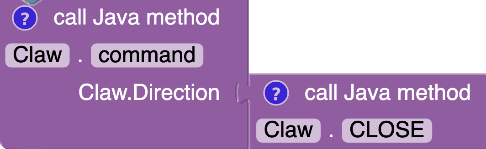{ width=450 }

    

    

    
Modify Servo Mechanism Attributes

    ### Construction

        org.edu_nation.easy_ftc.mechanism.Claw claw =
                new org.edu_nation.easy_ftc.mechanism.Claw.Builder(linearOpMode, hardwareMap)
                        .count(2)                                    // use two servos for this mechanism
                        .names(new String[]{"clawLeft", "newName"})  // change the names of the servos
                        .reverse()                                   // reverse all servos in the mechanism
                        .reverse("clawLeft")                         // reverse specific servo
                        .reverse(new String[]{"clawLeft", "newName}) // reverse multiple specific servos
                        .open(0.8).close(0.2)                        // adjust open and close positions
                        .delay(3)                                    // adjust the delay for non-smooth movement
                        .build();

    

    

    
Read and Display Sensor State

    ### Methods

     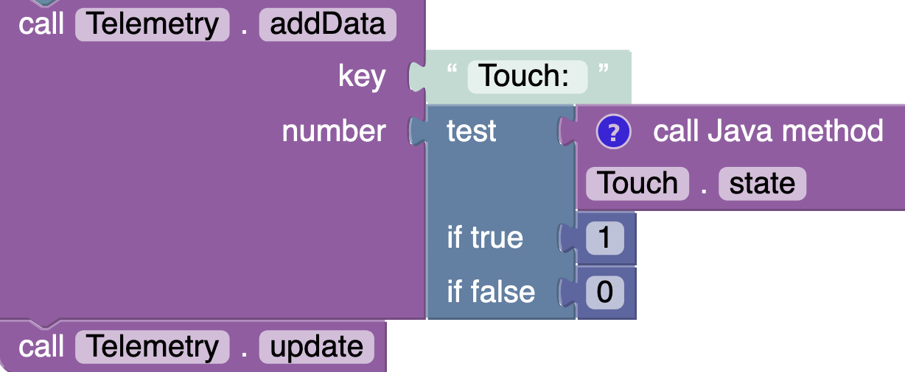{ width=600 }

    

    

    
Modify Sensor Attributes

    ### Construction

        org.edu_nation.easy_ftc.sensor.Distance distance =
                new org.edu_nation.easy_ftc.sensor.Distance.Builder(hardwareMap)
                        .name("distanceSensor") // change the name of the sensor
                        .reverse()              // reverse the sensor state
                        .threshold(6.0)         // change the distance threshold
                        .build();

    

    ### Enable Features

    As an easy-ftc object must be constructed for every Blockly function call, these objects are unable to persist their state, which breaks the following features for Blockly users:

    - Encoder limits in control()
    - Field-centric driving

    If these features are must-haves, use Java instead.

    

    
Encoder: Velocity-Based Control

    ### Construction

        org.edu_nation.easy_ftc.mechanism.Drive drive =
                new org.edu_nation.easy_ftc.mechanism.Drive.Builder(linearOpMode, hardwareMap)
                        .encoder()
                        .gamepad(gamepad1)
                        .build();

    ### Methods

     { width=225 }

    ### Notes

    - Unlike command(), adding .diameter() doesn't affect control(), so velocity will be used either way so long as .encoder() is enabled

    

    

    
Encoder: Time-Based Command

    ### Construction

        org.edu_nation.easy_ftc.mechanism.Drive drive =
                new org.edu_nation.easy_ftc.mechanism.Drive.Builder(linearOpMode, hardwareMap)
                        .encoder()
                        .build();

    ### Methods

     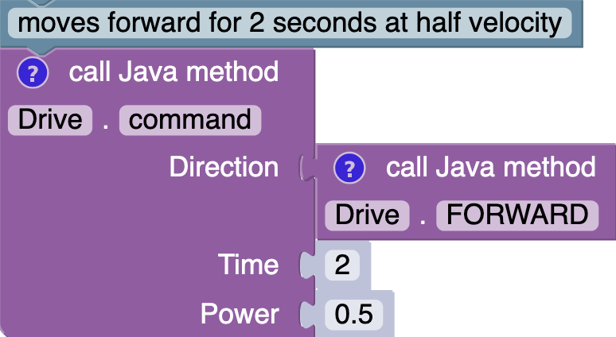{ width=450 }

    

    

    
Encoder: Distance-Based Command

    ### Construction

        org.edu_nation.easy_ftc.mechanism.Drive drive =
                new org.edu_nation.easy_ftc.mechanism.Drive.Builder(linearOpMode, hardwareMap)
                        .encoder().diameter(4).gearing(19.2)
                        .build();

    ### Methods

     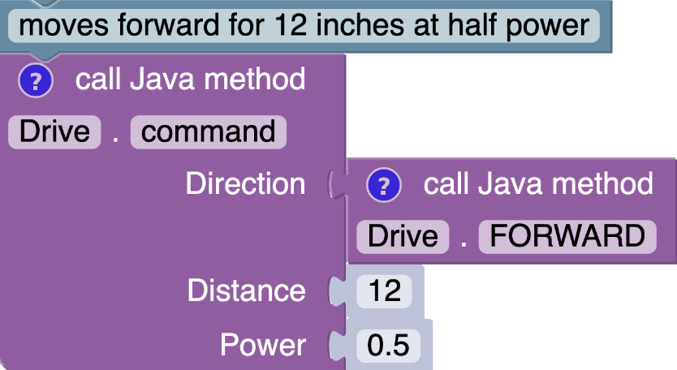{ width=450 }

    ### Notes

    - The distance unit used in command() will be the same as what's used in .diameter()
    - .gearing() is optional here, but correcting it can improve accuracy
    - The 'Time' parameterLabel in Drive.command() has been changed to 'Distance' here. This is optional, but it clarifies the intended functionality for Blockly users

    

    

    
Encoder: Command Limits Using Ticks

    ### Construction

        org.edu_nation.easy_ftc.mechanism.Lift lift =
                new org.edu_nation.easy_ftc.mechanism.Lift.Builder(linearOpMode, hardwareMap)
                        .encoder().up(300).down(-300)
                        .build();

    ### Methods

     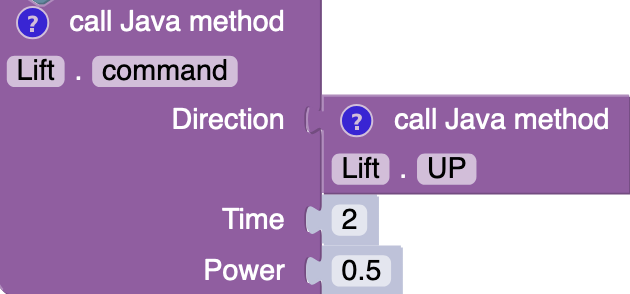{ width=450 }

    

    

    
Encoder: Command Limits Using Distance

    ### Construction

        org.edu_nation.easy_ftc.mechanism.Lift lift =
                new org.edu_nation.easy_ftc.mechanism.Lift.Builder(linearOpMode, hardwareMap)
                        .encoder().diameter(2).gearing(60).up(3).down(-3)
                        .build();

    ### Methods

     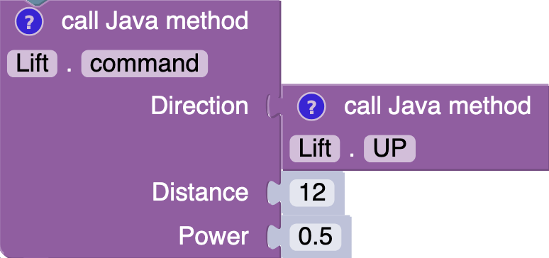{ width=450 }

    ### Notes

    - .gearing() is optional here, but correcting it can improve accuracy
    - The 'Time' parameterLabel in Lift.command() has been changed to 'Distance' here. This is optional, but it clarifies the intended functionality for Blockly users

    

    

    
Smooth Servo

    ### Construction

        org.edu_nation.easy_ftc.mechanism.Claw claw =
                new org.edu_nation.easy_ftc.mechanism.Claw.Builder(linearOpMode, hardwareMap)
                        .smooth()
                        .gamepad(gamepad1) // only needed for teleop
                        .build();

    ### Notes

    - The increment and incrementDelay can be adjusted if you'd like to change the 'smoothness' and/or speed

            org.edu_nation ...
                    new org.edu_nation ...
                            .smooth().increment(0.04).incrementDelay(0.01)
                            ...

    

    

    
Arcade Drive Control

    ### Imports

        import org.edu_nation.easy_ftc.mechanism.Drive.Layout;

    ### Construction

        org.edu_nation.easy_ftc.mechanism.Drive drive =
                new org.edu_nation.easy_ftc.mechanism.Drive.Builder(linearOpMode, hardwareMap)
                        .layout(Layout.ARCADE)
                        .gamepad(gamepad1)
                        .build();

    ### Methods

     { width=225 }

    

    

    
Mecanum Drive

    ### Construction

        org.edu_nation.easy_ftc.mechanism.Drive drive =
                new org.edu_nation.easy_ftc.mechanism.Drive.Builder(linearOpMode, hardwareMap)
                        .type(org.edu_nation.easy_ftc.mechanism.Drive.Type.MECANUM)
                        .gamepad(gamepad1) // only needed for teleop
                        .build();

    

    

    
Control of Motor Mechanism with Gamepad Deadzone

    ### Construction

        org.edu_nation.easy_ftc.mechanism.Lift lift =
                new org.edu_nation.easy_ftc.mechanism.Lift.Builder(linearOpMode, hardwareMap)
                        .gamepad(gamepad1).deadzone(0.1)
                        .build();

    ### Methods

     { width=225 }

    ### Notes

    - Deadzone only affects mechanisms using either Joysticks or Triggers (Drive and Lift)

    

    ### Advanced Use

    

    
Control with Command Sequence

    ### Additional

     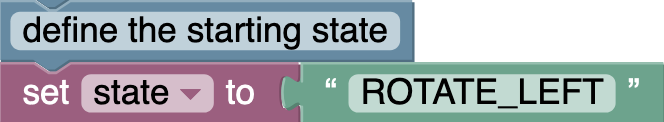{ width=385 }

    ### Methods

     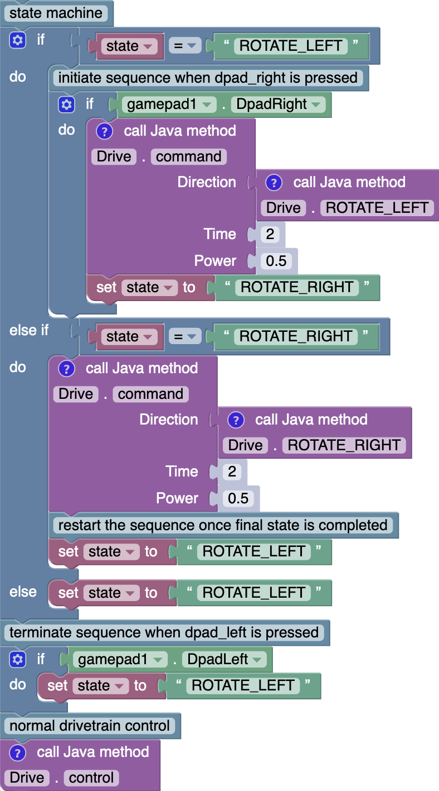{ width=600 }

    ### Notes

    - Sequence is initiated by pressing dpad_right and can be interrupted with dpad_left
    - Holding down dpad_left works best since the loop used by command() is thread blocking, meaning its value is only read between sequence states

    

