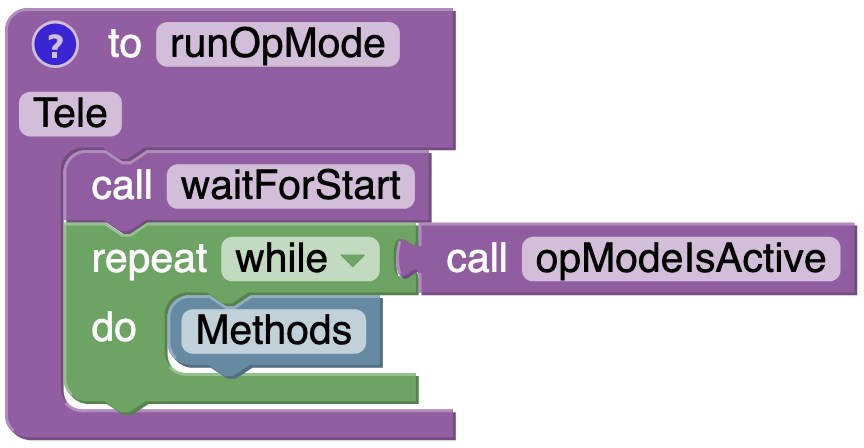

---
hide:
  - toc
---

# Getting Started

## Introduction

### Low-Level vs. High-Level Interfaces
When programming complex systems, there is an almost universal need for low-level control. In the context of FTC, this is often encountered in the hardware initialization stage of an OpMode, where, for example, you'll need to decide the behavior of your motors (direction, run mode, etc.).

The FTC SDK does a good job of providing an API (application programming interface) for accomplishing this, but this comes with some challenges for users. Namely, low-level control of individual motors, servos, and sensors does not always neatly translate into making robots perform high-level actions (like moving entire mechanisms).

Thus, there's room in the FTC ecosystem for what are called 'façade pattern' APIs, which interact with the FTC SDK's API at a low-level but provide users with massively simplified interfaces to control their robots' high-level actions in an intuitive manner.

This is what easy-ftc seeks to provide.

### Mechanisms
An obvious way to provide higher-level control of your robot is to think in terms of mechanisms, rather than motors or servos. For instance, many teams have four drive motors, which, intuitively, just combine to form a single mechanism - the drivetrain. In this example, rather than focusing on ways to reduce the repetition of setting up and controlling four closely related but distinct pieces of hardware, teams could opt to leverage easy-ftc's suitable mechanism named Drive, which can allow them to implement their drivetrain in as little as three lines of code.

### Standardized API
Another, less obvious tactic for creating simple, high-level interfaces, is to standardize the API as much as possible. As a counter-example, motors in the FTC SDK are often controlled via the function 'setPower()', whereas servos are most often controlled via 'setPosition()'. In isolation, this isn't a big deal, but as more advanced features and approaches are implemented, these subtleties can propagate through your codebase to such an extent that forgetting a single function name may cause hours of head-scratching.

This brings us to easy-ftc's API

## API

### command() - Mechanisms
command() is a function/method that tells (commands) a mechanism to move in a specific manner. This is most often seen in Autonomous routines, where most teams will program their robot to simply perform consecutive actions, though automated sequences in TeleOp can make use of commands as well. easy-ftc provides simple ways to command each mechanism at a specified power and direction for either time-based or distance-based movement.

### control() - Mechanisms
control() is a function/method that enables teleoperated control of each mechanism, which is only allowed in the TeleOp portion of a match. More explicitly, this function reads inputs from the gamepad, processes those inputs, and then controls the mechanism based on these processed inputs. easy-ftc decides the control scheme for you, which obviously takes away some user control but comes with the benefit of being able to program a competitive robot with a single function.

### state() - Sensors
state() is a function/method that returns the current state/value of each sensor. The return value depends on the exact sensor but is either a boolean (Touch returns true if the sensor is pressed, false if not) or RGB (Color returns one of RED, GREEN, or BLUE). When combined with conditional statements and command()/control(), this allows teams to determine their robots' actions based on the surrounding environment. For example, if the color sensor returns BLUE, move forward.

### Builder().build()
Most objects you'll encounter in Java are built with either basic constructors or setters, but both of these options can introduce some problems for both users and developers as the complexity of the object increases. All Mechanisms and Sensors in easy-ftc are constructed via nested Builder classes, which provide more clarity than constructors and eliminate the mutability of setters (say goodbye to confusing arguments and randomly reversed motors). This is where features (like encoders) are enabled and attributes (like device names) are modified.

## Usage
Before we can dive into coding, follow the Install section of the README

=== "Java"
    <h3>TeleOp</h3>

    First, create a Linear OpMode- note that easy-ftc only works with Linear OpModes

    

    
TeleOp - Starting Code

        package org.firstinspires.ftc.teamcode;

        import com.qualcomm.robotcore.eventloop.opmode.LinearOpMode;
        import com.qualcomm.robotcore.eventloop.opmode.TeleOp;
        // Imports

        @TeleOp(name="Tele", group="dev")
        public class Tele extends LinearOpMode {

            @Override
            public void runOpMode() {
                // Construction

                waitForStart();
                while (opModeIsActive()) {
                    // Methods
                }
            }
        }
    

    <i>Note the locations of Imports, Construction, and Methods</i>

    Before we can use easy-ftc, we'll need to import the relevant classes. Add the following to 'Imports'

        import org.edu_nation.easy_ftc.mechanism.Drive;

    Drive is a concrete class, which means we must instantiate it before our hardware can be controlled. easy-ftc relies on the Builder design pattern to accomplish this, as it enforces immutability (valuable for complex, stateful objects like we see in robotics) and makes arguments more explicit. View Examples or the Javadoc for more details on valid Builder methods

    Add this to 'Construction'- note that we must pass instances of the opMode (this), hardwareMap, and gamepad1

        Drive drive = new Drive.Builder(this, hardwareMap)
            .gamepad(gamepad1)
            .build();

    If you want to control a mechanism in TeleOp, you'll need to add a control() method call for that mechanism in the while loop. For every loop iteration, this block will read the relevant gamepad inputs and send them to that mechanism's hardware devices, enabling TeleOp control

    Add this to 'Methods' to make your robot drive

        drive.control();

    That's it! By default, this will control a two-motor tank drivetrain with the gamepad joysticks. This behavior can be changed by modifying the Builder methods (which is where hardware initialization is occurring)

    

    
TeleOp - Final Code

        package org.firstinspires.ftc.teamcode;

        import com.qualcomm.robotcore.eventloop.opmode.LinearOpMode;
        import com.qualcomm.robotcore.eventloop.opmode.TeleOp;
        import org.edu_nation.easy_ftc.mechanism.Drive;

        @TeleOp(name="Tele", group="dev")
        public class Tele extends LinearOpMode {

            @Override
            public void runOpMode() {
                Drive drive = new Drive.Builder(this, hardwareMap)
                    .gamepad(gamepad1)
                    .build();

                waitForStart();
                while (opModeIsActive()) {
                    drive.control();
                }
            }
        }
    

    <h3>Autonomous</h3>

    Let's do the same for autonomous

    Create a Linear OpMode

    

    
Autonomous - Starting Code

    
        package org.firstinspires.ftc.teamcode;

        import com.qualcomm.robotcore.eventloop.opmode.LinearOpMode;
        import com.qualcomm.robotcore.eventloop.opmode.Autonomous;
        // Imports

        @Autonomous(name="Auto", group="dev")
        public class Auto extends LinearOpMode {

            @Override
            public void runOpMode() {
                // Construction

                waitForStart();
                if (opModeIsActive()) {
                    // Methods
                }
            }
        }
    

    

    <i>Note the locations of Imports, Construction, and Methods</i>

    Import Drive

        import org.edu_nation.easy_ftc.mechanism.Drive;

    Construct Drive

        Drive drive = new Drive.Builder(this, hardwareMap)
            .build();

    As autonomous does not allow gamepad control, we'll need to use the command() method to move a mechanism in this match phase. This method commands mechanisms to move as the user specifies, with servo mechanisms taking only one argument (direction) and motor mechanisms taking three (direction, measurement, and power)

    Adding this to 'Methods' to make your robot drive forward for 3 seconds at half-power

        drive.command(Drive.Direction.FORWARD, 3, 0.5);

    Distance-based movement can be automatically used instead of time by adding .encoder() and .diameter(wheelDiameter) to Drive.Builder(). .gearing(motorGearing) may also need to be corrected for increased accuracy

    Now, what if you want your robot to move forward, then decide whether to move again based on the color of an object?

    This is where state() is used

    * Import Color and Color.RGB

            import org.edu_nation.easy_ftc.sensor.Color;
            import org.edu_nation.easy_ftc.sensor.Color.RGB;

    * Construct the sensor

            Color color = new Color.Builder(hardwareMap)
                .build();

    * Retrieve the state in 'Methods'

            color.state();

    This will allow your robot to read the color value of an object, but without additional logic, nothing will be different about your code. Let's change that

    * Add an if statement after the first command() call that checks if the state is equal to RGB.BLUE

            if (color.state() == RGB.BLUE) {

            }
            
    * Add another command() call inside the if statement

            drive.command(Drive.Direction.FORWARD, 3, 0.5);

    Now your robot will drive forward for 3 seconds at half-power, then do it again if it detects the color blue

    
    

    
Autonomous - Final Code

    
        package org.firstinspires.ftc.teamcode;

        import com.qualcomm.robotcore.eventloop.opmode.LinearOpMode;
        import com.qualcomm.robotcore.eventloop.opmode.Autonomous;
        import org.edu_nation.easy_ftc.mechanism.Drive;
        import org.edu_nation.easy_ftc.sensor.Color;
        import org.edu_nation.easy_ftc.sensor.Color.RGB;

        @Autonomous(name="Auto", group="dev")
        public class Auto extends LinearOpMode {

            @Override
            public void runOpMode() {
                Drive drive = new Drive.Builder(this, hardwareMap)
                    .build();
                Color color = new Color.Builder(hardwareMap)
                    .build();

                waitForStart();
                if (opModeIsActive()) {
                    drive.command(Drive.Direction.FORWARD, 3, 0.5);
                    if (color.state() == RGB.BLUE) {
                        drive.command(Drive.Direction.FORWARD, 3, 0.5);
                    }
                }
            }
        }
    

    Any mechanism or sensor can be implemented in this manner for either TeleOp or Autonomous. In fact, even command() can be used in TeleOp for planned sequences; see Examples for how to do this

=== "Blockly"

    <h3>TeleOp</h3>

    First, create an OpMode in the blocks editor Web UI

    * Press 'Create New OpMode'
     { width=150 }
    * Enter a name and use the default sample titled 'BasicOpMode'
     { width=550 }
    * Press OK
    * Move the green while loop block to before the blue if statement
     { width=400 }
    * Delete the blue if statement block

    By default, this is a Linear OpMode setup for TeleOp- note that easy-ftc only works with Linear OpModes

    

    
TeleOp - Starting Code

    { width=435 }
    

    <i>Note the location of Methods</i>

    If you want to control a mechanism in TeleOp, you'll need to add a control() block for that mechanism to 'Methods'. For every loop iteration, this block will read the relevant gamepad inputs and send them to that mechanism's hardware devices, enabling TeleOp control

    Let's see how to make your robot drive

    * In the 'Java Classes' dropdown, click Drive
     { width=150 }
    * Drag the 'control' block to 'Methods'
     { width=225 }

    That's it! By default, this will control a two-motor tank drivetrain with the gamepad joysticks. This behavior can be changed by modifying the Builder methods in Drive.java (which is where hardware initialization is occurring)

    

    
TeleOp - Final Code

    { width=435 }
    

    <h3>Autonomous</h3>

    Let's do the same for autonomous

    * Create a new OpMode following the instructions above
    * Change the OpMode annotation from 'TeleOp' to 'Autonomous'
     { width=300 }
    * Delete the green while loop block
     { width=400 }

    

    
Autonomous - Starting Code

    { width=350 }
    

    <i>Note the location of Methods</i>

    As autonomous does not allow gamepad control, we'll need to use the command() block to move a mechanism in this match phase. This block commands mechanisms to move as the user specifies, with servo mechanisms taking only one argument (direction) and motor mechanisms taking three (direction, measurement, and power)

    To make your robot drive forward at half-power for 3 seconds

    * In the 'Java Classes' dropdown, click Drive
     { width=150 }
    * Drag the 'command' block to 'Methods'
     { width=275 }
    * Drag the 'FORWARD' block to the 'Direction' argument of the 'command' block
     { width=350 }
    * Change 'Time' to 3 and 'Power' to 0.5
     { width=150 }

    Distance-based movement can be automatically used instead of time by adding .encoder() and .diameter(wheelDiameter) to Drive.Builder() in Drive.java. .gearing(motorGearing) may also need to be corrected for greater accuracy

    Now, what if you want your robot to move forward, then decide whether to move again based on the color of an object?

    This is where state() is used

    * In the 'Java Classes' dropdown, click Color
     { width=150 }
    * Drag the 'state' block to 'Methods' (it won't click in yet)
     { width=250 }

    This will allow your robot to read the color value of an object, but without additional logic, nothing will be different about your code. Let's change that

    * Click the 'Logic' submenu
     { width=100 }
    * Drag another if statement underneath the 'command' block
     { width=90 }
    * In that same submenu, drag an 'equals' block to the first line of this if statement
     { width=200 }
    * Move 'state' to the left half of the 'equals' block
    * Drag the 'BLUE' block in the 'Color' submenu to the right half of the 'equals' block
     { width=600 }
    * Copy and paste the existing 'command' block to be inside this if statement
     { width=500 }

    Now your robot will drive forward for 3 seconds at half-power, then do it again if it detects the color blue

    

    
Autonomous - Final Code

    
    

    Any mechanism or sensor can be implemented in this manner for either TeleOp or Autonomous. In fact, even command() can be used in TeleOp for planned sequences; see Examples for how to do this